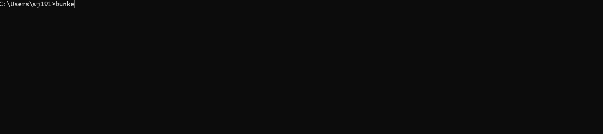

<h1 align="center">
   Bunker
</h1>

A lightweight HTTP/HTTPS forward proxy with built-in DNS server, written in Rust.

## Features

- **HTTP Forward Proxy** - Proxy HTTP requests with connection pooling
- **HTTPS Tunneling** - Transparent CONNECT tunneling for HTTPS/SSH/TLS traffic
- **DNS Server** - Optional DNS forwarding with caching and failover
- **Lightweight** - Single binary, minimal resource usage
- **Secure** - SSRF protection, rate limiting, IP allowlists
- **Windows Optimized** - System tray icon, auto-start support



## Quick Start

```powershell
winget install bunker
bunker --init     # writes %USERPROFILE%\.bunker\config.yaml
bunker            # auto-loads %USERPROFILE%\.bunker\config.yaml
```

The config in `%USERPROFILE%\.bunker\` lives outside any package-managed directory, so it survives `winget upgrade` and `scoop update`. You can also point at any other config file:

```powershell
bunker --config C:\path\to\config.yaml
```

At runtime, all configuration comes from the YAML file — there are no CLI overrides. To change the bind address, allowlist, or DNS settings, edit the file (or regenerate it with `bunker --init [mode] ...`) and restart.

`bunker` loads config from `--config <path>` if given, otherwise from `%USERPROFILE%\.bunker\config.yaml`. If neither is present, bunker prints an error and exits — run `bunker --init` to create one.

---

## Windows Setup

### Step 1: Install

**Option A: Install via [winget](https://learn.microsoft.com/en-us/windows/package-manager/winget/)**

```powershell
winget install bunker
```

**Option B: Install via [Scoop](https://scoop.sh)**

```powershell
scoop bucket add bunker https://github.com/wj1918/bunker
scoop install bunker
```

Scoop places `bunker.exe` in its app directory. The release zip ships only the binary — config lives at `%USERPROFILE%\.bunker\config.yaml` and survives `scoop update`. Bootstrap it with:

```powershell
bunker --init
notepad "$env:USERPROFILE\.bunker\config.yaml"
```

**Option C: Download from [GitHub Releases](https://github.com/wj1918/bunker/releases)**

```powershell
mkdir C:\Bunker
cd C:\Bunker

# Download the latest release
$VERSION = "v0.1.0"
Invoke-WebRequest -Uri "https://github.com/wj1918/bunker/releases/download/$VERSION/bunker-$VERSION-x86_64-pc-windows-msvc.zip" -OutFile bunker.zip
```

Verify download integrity before extracting:

```powershell
# Compare against SHA256SUMS.txt from the release page
(Get-FileHash bunker.zip -Algorithm SHA256).Hash
```

Extract and clean up:

```powershell
Expand-Archive bunker.zip -DestinationPath .
Remove-Item bunker.zip
```

The zip contains `bunker.exe` and `README.md`. Run `bunker --init` to create `%USERPROFILE%\.bunker\config.yaml` from the embedded default template.

**Option D: Build from source**

```powershell
git clone https://github.com/wj1918/bunker.git
cd bunker
cargo build --release

mkdir C:\Bunker
copy target\release\bunker.exe C:\Bunker\
```

### Step 2: Configure `config.yaml`

Run `bunker --init [mode]` once to create `%USERPROFILE%\.bunker\config.yaml` from the embedded default template, choosing the mode that matches how you'll reach the proxy:

| Mode | Command | `listen` written | `allowed_source_ips` written |
| --- | --- | --- | --- |
| `loopback` (default) | `bunker --init` | `127.0.0.1:8080` | `127.0.0.1`, `::1` |
| `lan` | `bunker --init lan` | auto-discovered LAN IP | that interface's `/24` (or actual mask) |
| `custom` | `bunker --init custom --listen <ip>:8080 --dns <ip>:53 --dns-upstream <ip>:53` | from `--listen` | derived from `--listen` (see below) |

**When to pick each:**
- **`loopback`** — only this machine connects to the proxy (CLI tools, local dev). Safest default.
- **`lan`** — other LAN clients connect. Requires exactly one RFC 1918 Ethernet interface; errors out on multi-NIC or Wi-Fi-only hosts. Use `custom` instead.
- **`custom`** — any non-trivial deployment: Wi-Fi-only host, multiple NICs, Tailscale/VPN clients, or wildcard bind (`0.0.0.0`). All three flags are required.

**Allowlist derivation for `--init custom`** (from `src/main.rs:618`):
- `--listen 0.0.0.0:8080` → union of every detected LAN subnet (loopback excluded).
- `--listen 127.0.0.1:8080` → loopback-only allowlist.
- `--listen <ip>` matches an interface → that interface's CIDR.
- `--listen <ip>` doesn't match → assumed `/24` around that IP; **narrow or widen by hand** before serving traffic.

**`--init` refuses to overwrite an existing file.** Delete or move `~/.bunker/config.yaml` first if you want to re-run it.

After `--init`, open the file and review/edit. A typical LAN deployment ends up looking like:

```yaml
# Proxy server
proxy:
  enabled: true
  # Use your Windows machine's LAN IP to serve other clients,
  # or 127.0.0.1 for loopback-only.
  listen: "192.168.1.1:8080"

  security:
    block_private_ips: true
    # Restrict access to your LAN clients only.
    # Add other CIDRs (e.g. "100.64.0.0/10" for Tailscale)
    # if clients connect from outside the LAN subnet.
    allowed_source_ips:
      - "192.168.1.0/24"
    rate_limit:
      enabled: true
      max_requests: 1000
      window_seconds: 60
    max_connections: 1000
    # Raise above 30 if you tunnel over high-latency links
    # and see slowloris-style timeouts on legitimate POSTs.
    header_read_timeout_seconds: 30

  connection_pool:
    enabled: true
    idle_timeout_seconds: 60
    max_connections_per_host: 10

  tcp_keepalive:
    enabled: true
    time_seconds: 60

# DNS server (optional — comment out the block to disable)
dns:
  listen: "192.168.1.1:53"
  upstreams:
    - "8.8.8.8:53"
    - "1.1.1.1:53"
  cache:
    enabled: true
    max_entries: 10000
  failover:
    timeout_ms: 2000
    serve_stale: true

# Logging (cross-cutting)
logging:
  log_requests: true
  format: text
  redact_sensitive_headers: true
  # Create the log_dir before first run: New-Item -ItemType Directory C:\Bunker\logs -Force
  file:
    log_dir: "C:\\Bunker\\logs"
    rotation: daily
    max_age_days: 7
    compress: true

# App (cross-cutting UI / system)
app:
  tray_enabled: true
```

### Step 3: Windows Firewall

Open **PowerShell as Administrator**:

```powershell
# Allow HTTP Proxy (TCP 8080)
New-NetFirewallRule -DisplayName "Bunker HTTP Proxy" `
    -Direction Inbound -Protocol TCP -LocalPort 8080 `
    -Action Allow -Profile Private,Domain

# Allow DNS Server (UDP 53) - only if using DNS feature
New-NetFirewallRule -DisplayName "Bunker DNS Server" `
    -Direction Inbound -Protocol UDP -LocalPort 53 `
    -Action Allow -Profile Private,Domain
```

Verify: `Get-NetFirewallRule -DisplayName "Bunker*" | Select-Object DisplayName, Enabled, Profile`

Remove: `Get-NetFirewallRule -DisplayName "Bunker*" | Remove-NetFirewallRule`

### Step 4: Run Bunker

Run from anywhere — Bunker picks up `%USERPROFILE%\.bunker\config.yaml` automatically:

```powershell
bunker
```

To use a different config explicitly:

```powershell
bunker --config C:\path\to\config.yaml
```

Lookup: `--config <path>` if given, otherwise `%USERPROFILE%\.bunker\config.yaml`. If neither is present, bunker errors out — run `bunker --init` to create one.

To run headless on Windows, set `app.tray_enabled: false` in your config file. There is no `--no-tray` runtime flag; runtime behavior is sourced from the YAML file only.

Other options:

```powershell
bunker --install     # Auto-start at Windows login
bunker --uninstall   # Remove auto-start
```

### Step 5: Verify

```powershell
# Check if listening
netstat -an | findstr ":8080"
netstat -an | findstr ":53"

# Test proxy locally
curl -x http://192.168.1.1:8080 http://httpbin.org/ip

# Test DNS locally
nslookup google.com 192.168.1.1
```

---

## Linux Client Setup

Configure Linux machines to use the Bunker proxy server running on Windows.

### Proxy Configuration

Add to `~/.bashrc` or `~/.zshrc`, then run `source ~/.bashrc`:

```bash
export http_proxy=http://192.168.1.1:8080
export https_proxy=http://192.168.1.1:8080
export HTTP_PROXY=http://192.168.1.1:8080
export HTTPS_PROXY=http://192.168.1.1:8080
export no_proxy=localhost,127.0.0.1,192.168.1.0/24
export NO_PROXY=localhost,127.0.0.1,192.168.1.0/24
```

This covers most CLI tools (curl, wget, git, pip, etc).

> **Note:** `sudo` clears the environment by default, so `sudo apt update`, `sudo curl …`, etc. won't see the proxy variables above. Use `sudo -E` to preserve them — for example, `sudo -E apt update`. To make it permanent, add this line to `/etc/sudoers` via `sudo visudo`:
>
> ```
> Defaults env_keep += "http_proxy https_proxy HTTP_PROXY HTTPS_PROXY no_proxy NO_PROXY"
> ```

Some applications need their own config:

<details>
<summary>Per-application proxy settings</summary>

**Git SSH (via CONNECT tunnel)** — add to `~/.ssh/config`:

```
Host github.com gitlab.com bitbucket.org
    ProxyCommand nc -X connect -x 192.168.1.1:8080 %h %p
```

**apt (Debian/Ubuntu):**

```bash
sudo tee /etc/apt/apt.conf.d/proxy.conf << 'EOF'
Acquire::http::Proxy "http://192.168.1.1:8080";
Acquire::https::Proxy "http://192.168.1.1:8080";
EOF
```

**yum/dnf** — add to `/etc/yum.conf` or `/etc/dnf/dnf.conf`:

```ini
proxy=http://192.168.1.1:8080
```

**Docker** — add to `~/.docker/config.json`:

```json
{
  "proxies": {
    "default": {
      "httpProxy": "http://192.168.1.1:8080",
      "httpsProxy": "http://192.168.1.1:8080",
      "noProxy": "localhost,127.0.0.1,192.168.1.0/24"
    }
  }
}
```

</details>

### DNS Configuration

Point your Linux DNS to the Bunker server.

**systemd-resolved (Ubuntu 18+, Fedora, Arch):**

```bash
# Edit /etc/systemd/resolved.conf
sudo sed -i 's/^#DNS=.*/DNS=192.168.1.1/' /etc/systemd/resolved.conf
sudo systemctl restart systemd-resolved
```

**NetworkManager:**

```bash
nmcli con mod "Wired connection 1" ipv4.dns "192.168.1.1"
nmcli con mod "Wired connection 1" ipv4.ignore-auto-dns yes
nmcli con down "Wired connection 1" && nmcli con up "Wired connection 1"
```

**Manual (temporary):**

```bash
sudo sh -c 'echo "nameserver 192.168.1.1" > /etc/resolv.conf'
```

### Verify Client

```bash
# Test proxy
curl -x http://192.168.1.1:8080 https://httpbin.org/ip

# Test DNS
dig @192.168.1.1 google.com
```

---

## Security Features

| Feature | Description |
|---------|-------------|
| SSRF Protection | Blocks requests to private IPs (127.x, 10.x, 172.16-31.x, 192.168.x) |
| DNS Rebinding Protection | Validates all resolved IPs before connecting |
| Rate Limiting | Per-IP request limits with IPv6 /64 subnet support |
| Connection Limits | Configurable max concurrent connections |
| IP Allowlist | Restrict proxy access to specific IPs/CIDRs |
| Header Sanitization | Redacts sensitive headers in logs |
| Slowloris Protection | Header read timeout |
| Request Size Limits | Configurable max request body size |

> **Note**: Bunker does not implement proxy authentication. Access control is managed via IP allowlists and network-level security.

---

## Supported Protocols

| Protocol | Support | Method |
|----------|---------|--------|
| HTTP | Yes | Direct proxy |
| HTTPS | Yes | CONNECT tunnel |
| SSH/SFTP | Yes | CONNECT tunnel |
| WebSocket (wss://) | Yes | CONNECT tunnel |
| Any TLS/TCP | Yes | CONNECT tunnel |
| DNS (UDP) | Yes | Built-in server |
| SOCKS5 | No | Not supported |
| HTTP/2 | No | Not supported |

---

## Troubleshooting

### Windows Server

**Proxy not accessible from LAN:**

```powershell
Get-NetFirewallRule -DisplayName "Bunker*" | Format-List
netstat -an | findstr ":8080"
Get-NetConnectionProfile
```

**DNS not responding:**

```powershell
netstat -an | findstr ":53"
nslookup google.com 127.0.0.1
```

### Linux Client

**Proxy connection refused:**

```bash
ping 192.168.1.1
nc -zv 192.168.1.1 8080
env | grep -i proxy
```

**DNS not resolving:**

```bash
dig @192.168.1.1 google.com
cat /etc/resolv.conf
resolvectl status
```

**Git SSH not working through proxy:**

```bash
ssh -vvv -o ProxyCommand="nc -X connect -x 192.168.1.1:8080 %h %p" git@github.com
# If nc doesn't support -X flag: sudo apt install netcat-openbsd
```

---

## Architecture

```
Linux Clients                     Windows Server (Bunker)
─────────────                     ───────────────────────
                                  ┌────────────────────────────────┐
┌─────────┐                       │         Bunker Proxy           │
│ Browser │──HTTP/HTTPS──────────►│                                │
│  curl   │                       │  ┌──────────┐   ┌───────────┐  │
│  wget   │                       │  │ Security │──►│   HTTP    │──┼──► Internet
└─────────┘                       │  │  Layer   │   │  Handler  │  │
                                  │  └──────────┘   └───────────┘  │
┌─────────┐                       │        │                       │
│   Git   │──SSH (CONNECT)───────►│        ▼        ┌───────────┐  │
│   SSH   │                       │  ┌──────────┐   │  CONNECT  │──┼──► Target
└─────────┘                       │  │ Allowlist│──►│  Tunnel   │  │
                                  │  └──────────┘   └───────────┘  │
┌─────────┐                       │                                │
│  Apps   │──DNS Query───────────►│  ┌──────────┐   ┌───────────┐  │
│(resolv) │                       │  │  Cache   │◄─►│    DNS    │──┼──► Upstream
└─────────┘                       │  │  (TTL)   │   │  Server   │  │     DNS
                                  │  └──────────┘   └───────────┘  │
                                  └────────────────────────────────┘
```

---

## Typical Usage

Two deployment patterns make the most of Bunker. Both treat the proxy as the **only** path out of an isolated network: clients have no default gateway, so any non-proxied traffic simply has nowhere to go. This gives you a hard egress boundary at L3 without writing firewall rules.

### 1. Back-to-back network

A *back-to-back* topology is two hosts wired directly to each other — one cable, no switch, no router in between. Historically this needed a crossover cable; modern NICs auto-negotiate (Auto-MDIX), so any straight patch cable works.

The client gets a static IP in the back-to-back subnet, points its proxy and DNS at Bunker, and **omits the default gateway**. The only way off the client is through the proxy.

```
┌──────────────┐                       ┌────────────────────────────┐                       ┌──────────────┐
│              │  eth0  (direct link)  │   Windows Host (Bunker)    │  uplink (LAN/Wi-Fi)   │              │
│   Client     │ ◄────────────────────►│                            │ ◄────────────────────►│ LAN Router / │
│              │    192.168.50.0/24    │   eth0:    192.168.50.1    │    192.168.1.0/24     │   Internet   │
│ 192.168.50.2 │                       │   uplink:  192.168.1.50    │                       │              │
│              │                       │                            │                       │              │
│ gateway:     │                       │   proxy: 192.168.50.1:8080 │                       │              │
│   (none)     │                       │   dns:   192.168.50.1:53   │                       │              │
│ dns:         │                       │                            │                       │              │
│ 192.168.50.1 │                       │   IP forwarding: OFF       │                       │              │
└──────────────┘                       └────────────────────────────┘                       └──────────────┘
```

**Why no default gateway:** if the client had a `0.0.0.0/0` route via Bunker, traffic could leak out by IP without ever touching the proxy. With no gateway, the only reachable host is `192.168.50.1` itself, and the only useful ports on it are `8080` (HTTP/HTTPS/CONNECT) and `53` (DNS).

**Bunker `~/.bunker/config.yaml` (excerpt):**

```yaml
proxy:
  listen: "192.168.50.1:8080"
  security:
    allowed_source_ips:
      - "192.168.50.0/24"
dns:
  listen: "192.168.50.1:53"
  upstreams:
    - "8.8.8.8:53"
    - "1.1.1.1:53"
```

**Do not enable Windows IP forwarding** on the Bunker host — `Get-NetIPInterface | Where-Object Forwarding -eq Enabled` should return nothing. If you turn it on, the client could route to the upstream LAN directly and bypass the proxy entirely.

### 2. Home lab or small office (isolated zone)

Same idea, but the isolated side is a whole subnet behind an L2 switch — multiple PCs, Raspberry Pis, IoT devices, build agents — instead of a single back-to-back cable. The Bunker host sits between the isolated VLAN/switch and your main LAN.

```
┌─────────────────────────────────────────┐                      ┌────────────────────────────┐                       ┌──────────────┐
│      Isolated Zone (no gateway)         │                      │   Windows Host (Bunker)    │                       │              │
│      192.168.50.0/24                    │                      │                            │  uplink (LAN/Wi-Fi)   │  LAN Router  │
│                                         │   eth0  (lab NIC)    │   eth0:    192.168.50.1    │ ◄────────────────────►│      /       │
│  ┌─────────┐  ┌─────────┐  ┌─────────┐  │ ◄────── L2 switch ──►│   uplink:  192.168.1.50    │    192.168.1.0/24     │   Internet   │
│  │ Lab PC  │  │ Lab Pi  │  │  IoT /  │  │                      │                            │                       │              │
│  │ .50.10  │  │ .50.20  │  │  .50.30 │  │                      │   proxy: 192.168.50.1:8080 │                       │              │
│  └─────────┘  └─────────┘  └─────────┘  │                      │   dns:   192.168.50.1:53   │                       │              │
│                                         │                      │                            │                       │              │
│  every client:                          │                      │   IP forwarding: OFF       │                       │              │
│    gateway = (none)                     │                      │                            │                       │              │
│    dns     = 192.168.50.1               │                      │                            │                       │              │
│    proxy   = 192.168.50.1:8080          │                      │                            │                       │              │
└─────────────────────────────────────────┘                      └────────────────────────────┘                       └──────────────┘
```

The isolated zone is a separate broadcast domain: a dedicated unmanaged switch, or one VLAN on a managed switch. Either run no DHCP server on that segment (static addressing) or hand out leases with DHCP option 3 (router) omitted — the *absence* of a default gateway is what does the work.

**Why this layout:**
- **Lab / IoT containment** — noisy or untrusted devices can still reach package mirrors, Git, container registries, and DNS, but only via Bunker, which logs every request and enforces the allowlist plus rate limit.
- **No accidental WAN exposure** — devices without a default route can't be reached by, and can't reach, anything off the isolated subnet directly. The only listener that talks to both sides is Bunker.
- **Auditable egress** — with `logging.log_requests: true`, every CONNECT and HTTP request from the zone lands in `C:\Bunker\logs\`.

**Bunker `~/.bunker/config.yaml` (excerpt):**

```yaml
proxy:
  listen: "192.168.50.1:8080"
  security:
    allowed_source_ips:
      - "192.168.50.0/24"
    rate_limit:
      enabled: true
      max_requests: 1000
      window_seconds: 60
dns:
  listen: "192.168.50.1:53"
  upstreams:
    - "1.1.1.1:53"
    - "8.8.8.8:53"
```

Same warning as above: **do not enable Windows IP forwarding** on the Bunker host. Bunker is the bridge; the IP stack is not.

---

## Building

### Requirements

- Rust 1.70+
- Windows: MSVC toolchain

### Commands

```powershell
cargo build --release    # Release build
cargo build              # Debug build
cargo test               # Run tests
cargo check              # Syntax check only
```

---

## License

Licensed under the Apache License, Version 2.0. See [LICENSE](LICENSE) for details.
